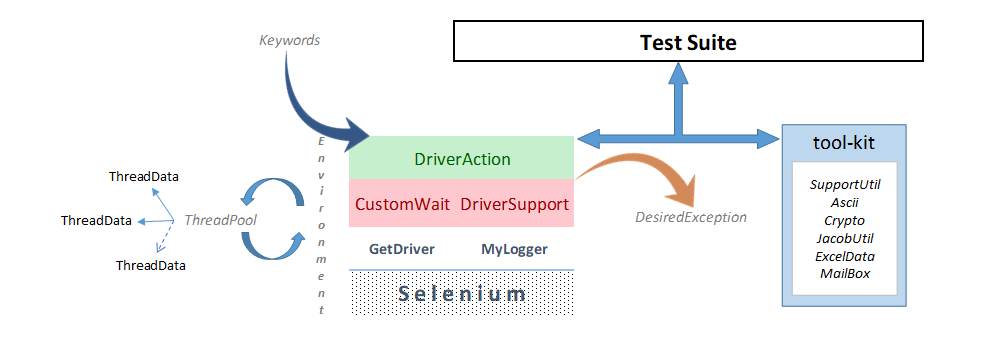

# Selenium Utilities 
 -blue.svg)   

Supporting utilities to develop automation suite with Java/Selenium.
Web Automation and File Automation related basic reusable building blocks are put together for faster prototyping.
Test Automation Framework as API.

## Get Ready for Rapid Prototyping.

### Just Add this inside pom.xml
```
<repositories>
  <repository>
    <id>SeleniumUtilities-mvn-repo</id>
    <url>https://raw.github.com/sahasourav123/SeleniumUtilities/mvn-repo/</url>
    <snapshots>
      <enabled>true</enabled>
      <updatePolicy>always</updatePolicy>
    </snapshots>
  </repository>
</repositories>

<dependencies>
  <dependency>
    <groupId>automation</groupId>
    <artifactId>SeleniumUtilities</artifactId>
    <version>1.0.7</version>
  </dependency>
</dependencies>
```

### Example
[See Example](https://github.com/sahasourav123/SeleniumUtilities/blob/master/src/test/java/example/Examples.java) using this Utility Library.

### Get Compatible Driver
Download compatible driver.exe.
Place it in project folder.
* [32-bit IE Driver](https://goo.gl/9Cqa4q)
* [64-bit IE Driver](https://goo.gl/AtHQuv)
* [Chrome Drivers](https://sites.google.com/a/chromium.org/chromedriver/downloads)
* [Gecko Drivers(Firefox)](https://github.com/mozilla/geckodriver/releases/)

### Create Broswser Instance
```
WebDriver driver;
String url = "https://github.com/sahasourav123/SeleniumUtilities";

// Create Chrome Driver Instance with initial URL
driver = new GetDriver().chromeDriver(url);

// Create IE Driver Instance with Initial URL
driver = new GetDriver().ieDriver(url);

// Create Firefox Driver Instance without Initial URL
driver = new GetDriver().firefoxDriver();
```

DriverSupport Object handles interaction with WebElement 
 ```
DriverSupport support = new DriverSupport(driver);
```
Rapid Data Entry Object (Wrapper on DriverSupport Class)
```
DriverAction action = new DriverAction(driver);
```
SendKeys/ Select From Dropdown & SelectRadioButton using DriverAction (all One-liner)
```
action.setText(Keywords.Name, "first_name", "Sourav");
action.selectDropdownOption(Keywords.Name, "state", "Texas");
action.selectRadioOption(Keywords.Name, "hosting", "No");
support.jsClick(Keywords.Xpath, "//button[@type='submit']");
```

 Find a WebElement or perform an action quickly using Keywords enum and :
 
    
 
    

      
 
 ```
By byElement = support.customLocator(Keywords.IdStartWith, "Quote");
```
Check if Element present in dom
```
boolean isElement = support.isElement(byElement);
```
Click on the element if present
```
support.jsElement(byElement);
```

CustomWait object handle different types of wait on WebElement, iFrame and WindowsHandle
```
CustomWait wait = new CustomWait(driver);
```
Wait up-to specified seconds for a element and return boolean status
```
boolean status;
status = wait.explicitWait(8, byElement);
status = wait.waitForInvisibilityOfElement(5, Keywords.IdContains, "Partial_id_of_element");
status = wait.waitForStalenessOfElement(5, Keywords.Xapth, "XPath_of_element");
```
### How the architecture looks like

